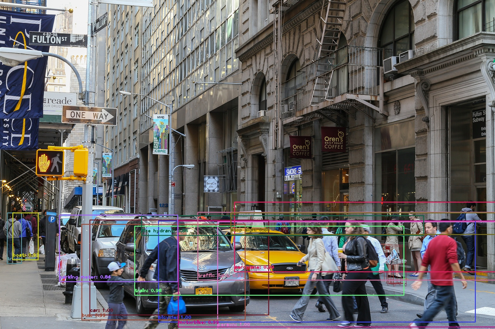
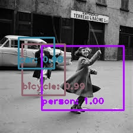
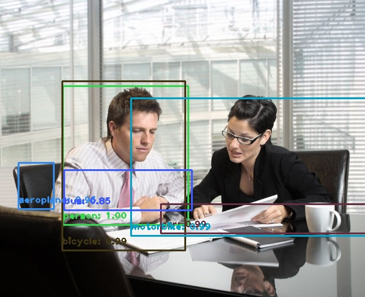

# Object Detection
Detects and label object in a given image with python OpenCV library using yolo3 pre-trained model weights.








## How model works
Works on a open-cv with a pre-trained YOLO network.

## How to run

### Dependencies
1. Works on python3
2. Install Opencv library
```
python3 - pip install -r requirements.txt
```

### Download pre-trained weights and configuration files
Download the following weight file to root directory if not already downloaded:
[yolov3.weights](https://pjreddie.com/media/files/yolov3.weights)

### Input images
The [Inputs](Inputs) directory already contains images for validation. You can add more images to that folder.

### Run model

```
python3 object_detection.py
```

You can also run the ipynb file for better understanding.

### Results
Results will be save at the [Outputs](Outputs) folder. Some existing samples have been displayed above.